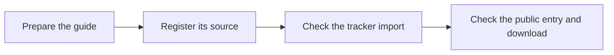

# Listing Your Skill Repo in the Task Library

Add your task guide to the library so your team can find and use it. Check the public entry so no one follows an old file or a broken link. First use the [publishing guide](https://blitzmetrics.com/skill-publishing-standard/) to prepare the skill and its matching web page.




How to format a GitHub repo so your skill shows up on the Task Library dashboard with a working "download everything" link — while you keep full ownership of the code in your own repo.

The short version: **you don't reformat your skill, you register it.** A normal Claude skill layout can use the library’s external-skill format, but it must still pass the source and required-field checks below. A plugin alone is not a registered skill. The library needs the location of each SKILL.md and a working full-package download.

---

## What your repo needs (the checklist)

1. **A public GitHub repo** (private works too, but requires the library's read token — ask the maintainer).
2. **One folder per skill** containing a `SKILL.md`, with any supporting files in `references/` next to it. This is the standard Claude skill layout:

```
your-repo/
├── skills/
│   ├── your-main-skill/
│   │   ├── SKILL.md
│   │   └── references/
│   └── your-helper-skill/
│       ├── SKILL.md
│       └── references/
├── README.md
└── (optional) .claude-plugin/ files if you also ship it as a plugin
```

3. **SKILL.md frontmatter with `name` and `description`.** That's all the library reads from the file:

```markdown
---
name: your-main-skill
description: One clear first sentence saying what the skill does and for whom.
  Trigger phrases and details can follow — only the first sentence shows
  on the dashboard card.
---
```

The first sentence of your description becomes your dashboard card text. Write it for a human deciding whether to click.

4. **A download URL that serves the whole package.** You get one for free — every GitHub repo has a permanent archive link:

```
https://github.com/<you>/<your-repo>/archive/refs/heads/main.zip
```

Better: cut a **Release** (GitHub → Releases → "Draft a new release", attach a zip or let it auto-package). Then use:

```
https://github.com/<you>/<your-repo>/releases/latest/download/<your-asset>.zip
```

The difference matters: `main.zip` is whatever your repo looks like right now, mid-edit and all. A release is a version you deliberately shipped. The library convention is *releases for anything marked ready*.

---

## Register through the connected Asset Tracker

Use the existing **Task Library Dashboard tab of the Asset Tracker** if you have permission to edit it. Before relying on this path, ask the maintainer to confirm that the build imports that tab’s approved feed. The dashboard’s team-update notice reports whether tracker rows were loaded for that build. If the notice says they were not loaded or the import is unknown, a saved sheet edit is still pending public sync. Do not change sharing or publish a private sheet to clear this step.

Find the existing task row first; add a new row only for a new permanent task name. Fill in:

| Column | What to put |
|---|---|
| Slug | your skill's name (must match `name` in your SKILL.md frontmatter) |
| Category | one of the 13 library categories |
| Status | `ready`, `wip`, or `gap` |
| Owner | you |
| Source Repo | your repo URL — `https://github.com/you/your-repo` |
| Download URL | optional; defaults to your repo's zip archive |

That's it. The build assumes your SKILL.md is at `skills/<slug>/SKILL.md` in your repo. If it lives elsewhere, paste the deeper link instead — a folder link (`.../tree/main/path/to/skill-folder`) or a direct file link (`.../blob/main/path/to/SKILL.md`) both work. A build with the intended tracker feed can fetch and validate that source. After deployment, compare the public task’s owner, status, source, article and download against your intended values. Errors appear in the build log. A green build alone does not prove the tracker was imported or your change reached readers.

Registering a suite: one row per skill, same Source Repo on each.

## Registering it — the registry way (for pinning and local skills)

The sheet path tracks your `main` branch. If you want to pin a specific commit, use a release download asset, or add a skill that lives *in* the central repo, add an entry to `build/registry.json` instead:

```json
"your-main-skill": {
  "source": "github:<you>/<your-repo>@main:skills/your-main-skill/SKILL.md",
  "format": "claude-skill",
  "category": "Strategy & Measurement",
  "status": "needs-work",
  "article": "/your-definitive-article",
  "download": "https://github.com/<you>/<your-repo>/releases/latest/download/<asset>.zip",
  "flag": "optional note reviewers should see"
}
```

Field by field:

- **source** — where the build fetches your SKILL.md. `@main` tracks your latest; pin a commit SHA (`@a1b2c3d`) to freeze a version.
- **format: "claude-skill"** — tells the validator this is a standard Claude skill (name + description frontmatter only). Without this, the file is validated against the full Task-Library-Standard format instead.
- **category** — one of the 13 library categories. Required.
- **status** — `complete`, `needs-work`, or `gap`. Defaults to `needs-work`; `complete` should mean you, the owner, stand behind it. The Asset Tracker sheet can override this later without touching the registry.
- **article** — your skill's definitive article (short URL like `/dad`, or omit if it doesn't exist yet — that's your gap to close).
- **download** — the full-package link described above. This renders as "Download full skill suite ⬇" on your dashboard card.

**Multi-skill suites** (a quarterback that dispatches helpers): register each skill as its own entry, all pointing at the same repo and the **same download URL**. Whichever piece someone finds, the download gives them the complete system. Worked example: the `google-ads-analyzer` entry in the registry.

---

## What happens after you register

The build runs daily and on changes to the central repository. Sheet-driven changes apply only when that build imports the intended tracker feed. For each registered source it:

1. Fetches your SKILL.md from your repo.
2. Validates it: frontmatter has `name` + `description`, and your registry entry has a valid category/status. Fetch failures may reuse a previously cached source if one is available. This fallback is reported in the log and can leave old content visible. A validation error is different: it fails the build. Neither outcome proves that your latest edit shipped.
3. Publishes it to the dashboard: your description's first sentence on the card, your full SKILL.md in the detail view, your download link on both.

After registration, maintain the method in its owning repository. For each release, check the actual fetched revision, deployed task and full-package download. Updating a source file does not by itself prove the public copy is current. Changes to a pinned source, category or download may also need a registry update.

## Ownership expectations

Name the accountable **owner** in the Asset Tracker and verify that the built record displays that name. The owner keeps the instructions current and closes the linked article gap. Status `complete` records the contributor’s claim about the document; it does not prove independent review or a client execution. Record the reviewer, exact revision, examples and acceptance evidence before claiming verified readiness. Git history records source changes. Write the [meta article for the actual run](https://blitzmetrics.com/meta-article-prompt/) separately, using its task link and execution ID.

## Common rejections

The build log will tell you, but these are the usual ones: missing or empty `name`/`description` in frontmatter; frontmatter `name` doesn't match the registry slug (warning — registry wins); registry entry missing `category` or using a status/stage outside the allowed values; the source path 404s (typo in the path, renamed folder, or the repo went private without a token).

## If the tracker update does not arrive

A missing tracker feed leaves the dashboard on saved library records. Keep the edit in the existing tracker and report the task name, intended value and observed public value to the maintainer through the authorized project channel. Do not create a second tracker or claim a new owner from a byline. The maintainer checks the approved feed, intended tab, parser result and deployment, then reads the task back publicly. The dashboard’s import notice and counts describe the build input; they do not certify the task.

Finish with the checked public task and package, or a named pending state. Save the result and next owner in the [work record](https://blitzmetrics.com/meta-article-prompt/). A new user still needs to load the files, supply the required access and complete a checked first run before any optional schedule.
