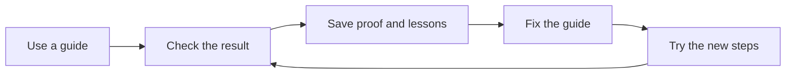

# Keep the Task Library useful

These guides help you get work done without starting from scratch. Each time you use one, check the result and save what you learned. Fix a confusing step so the next business owner has an easier time.



This is **recursive self-improvement (RSI)**: use what happened in one run to improve the next. A [definitive guide](https://blitzmetrics.com/definitive-article-guide/) is the main recipe. A [meta article](https://blitzmetrics.com/meta-article-prompt/) records what happened when someone used it.

Start at the [Task Library Dashboard](https://blitzmetrics.com/task-library-dashboard/). Pick a task that helps your business now. A download gives you instructions; it does not connect accounts, install an app, or start a worker. Library-built ZIPs include `START-HERE.md`. An outside provider's full suite may use different setup instructions; check its README and required files. Check access and try one task before adding a recurring schedule.

## Start with evidence

Use this process after a real task run, after an upstream instruction or tool changes, or when a reader reports a problem. A scheduled maintenance pass also works through known gaps. The schedule is a separate setup step; this document alone does not activate it.

Before editing, collect the exact task slug, current recipe revision, latest run record, observed problem, and relevant source. Read the latest source again before saving. Keep other people's changes. Check the registry and source-owner rules in [README.md](README.md) so the fix reaches the maintained file and its published copies.

## Work in small batches

1. Read the last maintenance checkpoint and new run records. Reuse successful checks when their source, output, and relevant dependencies are unchanged. If evidence is stale or absent, say so.
2. Put broken setup, missing files, misleading instructions, and failed results first. Next, improve the most-used tasks with verified failures. When actual use is unknown, use the documented importance estimate and label that choice.
3. Select at most three related guides for one batch. Finish their review and save a checkpoint before selecting another batch. A daily scheduled pass should normally stop after one batch; a longer requested project may continue with a new checkpoint.
4. Fix the cause in the maintained source. A real task recipe needs a starting condition, inputs and access, prerequisites with checked outputs, ordered steps with expected results, a measurable final result, and the next task or owner. Explain unfamiliar terms and link their maintained guides. Keep the opening clear for a fifth grader and show a useful first-screen picture or diagram.
5. Check the change. Use scripts for counts, links, archive contents, and exact-source comparisons. Use human or agent judgment for meaning, source quality, voice, and whether the steps will work. Escalate only the step that needs more capable reasoning.
6. Publish through the approved route and read the result where readers receive it. A successful save, build, or deployment is not enough by itself. Keep failed and uncertain checks visible.
7. Record the lesson, changed revision, checks, and next action. The next real use must test the revised steps; a promising edit is not a proven outcome.

## Check what a new user receives

- Download the published ZIP when its contents or build dependencies changed. Check its integrity and that each named script, template, and companion file is present or clearly provided by a linked full suite.
- For library-built ZIPs, confirm that `START-HERE.md` explains the app setup, required access, a first task, where to save proof, and optional recurring schedules. For an external suite, verify the equivalent instructions and full dependency set; do not claim our ZIP checks certify that archive. Missing access stays a named setup step.
- Check edited public documents at phone and desktop sizes. Verify readable opening text and meaningful visible media after the page settles. For shared layout changes, cover the affected templates and review anomalies; do not repeatedly recapture unchanged pages. Keep media muted with volume zero.
- Build previews from the actual page and its styles, replacing only the part being changed. Use the same markup and styles that will be published. A bare test page or extra preview-only styling cannot prove the real page works. When a diagram sits inside an expandable section, record its initial state and test the opened view through the page's own control.
- Read each diagram like a set of directions. Check that its arrows show the real order and handoffs. A diagram can keep every label and still tell the wrong story. Inspect the actual phone and desktop views for joined words, clipped labels, and overlapping text.
- Check each image description against the image and nearby text. A filename, URL fragment, or copied article title does not explain an image. Describe what matters to the task. Keep purely decorative images silent for screen readers and verify that the public page preserves that choice.
- When a check fails before it captures the page, save the failure and identify the stage that stopped. Test a checker fix against a known-good page and a known failure. A longer, finite wait may fix a timing problem; lowering the quality rules does not. Keep checker errors separate from page defects and unverified results.
- Keep the guide, skill, pack, plugin description, and agent setup consistent. A skill supplies instructions; a pack groups skills; a plugin packages app capabilities; an agent uses available tools to do work. A schedule triggers recurring work after setup.
- Link concepts through the maintained [SEO Tree](https://blitzmetrics.com/seo-tree/) structure. Preserve official provider links where a step requires that provider or cites primary evidence. Do not substitute an unrelated internal page just to avoid an external link.
- Show each real task's place in the [Content Factory](https://blitzmetrics.com/content-factory/): its inputs, the stage it serves, checked output, and receiving task. A support task may serve several stages.

## Measure progress honestly

Keep these measures separate, with a date and source:

| Measure | What it proves |
|---|---|
| Reviewed instructions | The exact guide revision passed document review |
| Reported complete | The contributor's recorded status; not independent execution proof |
| Verified real runs | Distinct executions with output and acceptance evidence |
| Setup success | A new user loaded the needed files, had access, and completed the first task |
| Recurring failures | A specific step failed again after a proposed fix |
| Changed-guide coverage | Required checks passed for each changed guide and affected dependency |
| Remaining gaps | Named missing instructions, evidence, source ownership, or access |

Use [EXECUTION-LEDGER.md](EXECUTION-LEDGER.md) for real runs. Resume an interrupted run under the same execution ID. Reviews, retries, subagent contributions, and article revisions do not create extra executions. A new maintenance run may have its own ID when it performs a separately scoped task; it does not count as running every guide it reviewed. Keep private proof private and label draft or unpublished meta articles accurately.

## Use the available budget well

Elapsed time is not a token bill. When available, record model, technical input/output counters, cached input, elapsed time, and account allowance snapshots separately. Mark missing values unknown. Do not convert token counters into subscription percentages or dollars without a supported accounting rule. An account-wide change can include other tasks.

Use deterministic scripts for repeat checks and an available local model for bounded extraction or first drafts. A reviewer checks its output. Local model work does not establish that a Codex supervisor used no allowance. If the local worker times out, record that result and route the blocked step without retrying it endlessly.

End each batch with: what improved, the exact proof, what remains, and the next starting point. A scheduled run should notify the owner when it ships a meaningful improvement, finds a failure, or needs a specific action. An unchanged pass should stay quiet.

## Save a checkpoint that the next run can find

The worker running maintenance owns `<working-project>/.task-library/maintenance-checkpoint.json`. Set the working project explicitly in the schedule or task prompt and keep using that location. Store this operational file outside the public library repository; it may point to private evidence. It is a resume record, not a second task registry or execution counter.

Use these fields, preserving unfinished items when you update the record:

```json
{
  "schemaVersion": 1,
  "updatedAt": "ISO-8601 UTC time of the actual checkpoint",
  "owner": "Responsible task or worker",
  "executionId": null,
  "sourceRevisions": {},
  "completedChecks": [],
  "remainingItems": [],
  "nextAction": "The next concrete step",
  "evidence": []
}
```

Each remaining item names its issue, existing task slug or source URL, state, and next action. Each check names its source revision, result, and evidence path or URL. Use `executionId` only to reference an actual recorded recipe execution; a checkpoint save does not create one. Source revisions determine which successful checks can be reused. A different worker must read the same file before continuing.

## Done and next

A maintenance batch is done when its selected fixes are reviewed, published where authorized, checked at their destinations, and linked to a truthful run record. Unfinished items remain in the checkpoint. The next task is a real use of the revised recipe or the next documented maintenance batch.

Follow [Task-Library-Standard.md](Task-Library-Standard.md) for acceptance requirements. Continuous improvement means the loop runs and learns; it does not mean every task is certified or every scheduled run must change a file.
