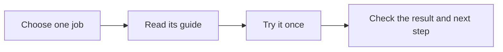

# BlitzMetrics Task Library

Use these guides to save time on work that helps your business. Pick one job and follow its steps. Use the [Task Library Dashboard](https://blitzmetrics.com/task-library-dashboard/) to find that guide, then check its result before you pass work to the next person.



New here? Open a guide on the [Task Library Dashboard](https://blitzmetrics.com/task-library-dashboard/) (public entry; this GitHub Pages app is embedded there) and copy its first-run prompt. Library-built ZIPs include `START-HERE.md`; an external provider's full suite may use its own setup guide. A ZIP gives you guides; app setup, account access, and optional schedules each need their own check.

**Public canon (hub lists):** [blitzmetrics.com/task-library-dashboard/](https://blitzmetrics.com/task-library-dashboard/). This GitHub Pages app is the embedded runtime (and stays `noindex`); do not list `github.io/task-library` as a separate public hub. The dated archive post is [blitzmetrics.com/task-library/](https://blitzmetrics.com/task-library/).


Hub-and-spoke skill library. This repo is the **hub**: the registry, the dashboard, and the default home for skill files. Skills can also live in their owner's own repo (the **spokes**) — the build pulls them in at build time.

## Layout

```
skills/<category-folder>/<slug>.md   skill files that live in this repo ("local")
build/registry.json                  slug -> source; THE index of the library
build/task-executions.json           distinct real executions, not article revisions
build/article-certifications.json    URL holds plus optional exact-revision semantic evidence
build/ARTICLE-SEMANTIC-REVIEWS.md    versioned semantic review/observation schema
build/standard_verification.py       derived per-task standard checks and review queue
build/categories.json                the 13 categories (order, icons, colors)
build/site-meta.json                 meta-article URL (counts and build date are derived)
build/build.py                       resolve -> validate -> compose dashboard/data.json
dashboard/                           index.html + app.js + generated data.json
Task-Library-Standard.md             the spec every skill.md must meet
.github/workflows/build.yml          CI: build + deploy to GitHub Pages
```

> **Bringing your own skill repo?** See [CONTRIBUTING-SKILLS.md](CONTRIBUTING-SKILLS.md) — the full guide to formatting and registering an external skill including the required fields, sections, source ownership and validation.

## Owning a skill in your own repo

Use the **Asset Tracker’s Task Library Dashboard tab** to record upkeep ownership when its approved feed is connected. A saved row alone does not prove a public update. Check the dashboard’s team-update notice before relying on this path:

1. Put your `SKILL.md` in your repo at `skills/<slug>/SKILL.md` (standard Claude skill format — `name` + `description` frontmatter, `name` = the slug).
2. On your skill's row in the sheet: put your name in **Owner**, your repo URL in **Source Repo**, and set **Status** (`wip` while you work it, `ready` when you stand behind it).
3. Check the next daily or manual build. Confirm that it fetched the intended source, shows your owner and status, and serves the current guide. After registration, keep the method in your own repo; an unsuccessful fetch may leave the prior cached copy visible.

The precedence rule: **sheet beats registry beats hub file** — a skill has exactly one live source, and the sheet's Source Repo cell is the switch. The Slug column completes the address, so a bare repo URL is enough when you follow the standard layout; use a deeper `/tree/` or `/blob/` link only if your file lives elsewhere.

`build/registry.json` is maintainer plumbing, not a contributor surface: it holds the hub-resident skills and the advanced cases (commit-SHA pinning, release-asset downloads). Fetch failures fall back to the last good cached copy, so a deleted repo never blanks the dashboard. Private repos need `SKILLS_READ_TOKEN` set in Actions secrets.

## Validation

`build/build.py` rejects skills that: lack frontmatter or any required field, have `name` ≠ slug, use an unknown category/stage/status, or miss required sections (Inputs, Steps, Definition of done, Examples, Definitive article & links). It warns (build passes) on: stub language in a `complete` skill, <3 numbered steps, frontmatter/registry category mismatch. URL readiness also respects reviewed semantic holds in `build/article-certifications.json`; a hold can force a hub to WIP without falsifying its tasks' completion status and can never force a hub ready. Optional task-specific semantic reviews in that same file require a separate observation of the exact current article representation, renewed within 24 hours; see `build/ARTICLE-SEMANTIC-REVIEWS.md`.

The same build writes `dashboard/verification-queue.html`, `.json` and `.csv`. This per-task projection keeps document review, contributor status, article mapping/catalog state, semantic holds, attributed examples, execution records, acceptance and setup evidence separate. Unknown proof stays unknown. Use the queue to select the next bounded review; do not hand-edit it or infer a full pass from a nearby metric.

## Asset Tracker

The Asset Tracker’s *Task Library Dashboard* tab is the maintained source for status, owner and flags. Its import is a separate setup step. A maintainer verifies the intended tab and existing approved feed, then configures `TRACKER_CSV_URL` for the build. Publishing a private sheet or changing access needs the appropriate authority; do not do it just to satisfy a setup check. When no feed is supplied, the build uses saved library records and reports that team updates were not loaded. When a feed is supplied, validation must pass before publication.

Check `trackerImport` in the generated data and the dashboard notice, then compare the affected public task fields. A loaded feed does not establish complete coverage, a current source fetch, correct per-task values or accepted execution. Content comes from the maintained repository; sheet-driven source/status/owner overrides apply only when actually imported.

The sheet is also the **onboarding path**: a row whose Slug isn't in the registry but has a Source Repo link can become a new external skill when the intended sheet is imported and its source validates. A successful deployment and exact public readback are still required. See CONTRIBUTING-SKILLS.md.

## SEO

The dashboard itself is `noindex` (it's a utility, not the ranking surface — and it must never compete with the hub articles from a github.io origin). The build also emits **`dashboard/library-index.html`**: a plain semantic HTML fragment — category H2s, every task with its description, and links to mapped article hubs. Its summary derives the number of mapped hubs and the subset that is actually definitive from task status plus reviewed URL-level semantic holds. Paste it into the WordPress task-library page *below* the iframe (or template it in) so blitzmetrics.com serves an indexable representation of the library with internal links to the hubs. Refresh the paste when categories/articles change materially; the fragment is deterministic, so a diff shows when.

## Stable links to one task

The dashboard accepts a permanent `?task=<slug>` query and opens the matching task in
context. For example:

```text
https://local-service-spotlight.github.io/task-library/?task=positive-mentions-harvester
```

Prefer hub lists and human entry via `https://blitzmetrics.com/task-library-dashboard/` (embeds this app). Keep github.io deep-links for iframe/`postMessage` plumbing.

The WordPress dashboard page embeds this app across origins, so an outer-page query is
not inherited by the iframe. A same-domain wrapper may forward its validated `task`
value after the iframe loads with
`postMessage({btlTask: slug}, 'https://local-service-spotlight.github.io')`; the app
accepts that message only from `https://blitzmetrics.com`.

## Local build

```
python3 build/build.py          # writes dashboard/data.json + library-index.html, exit 1 on validation errors
```

## Recorded executions

[EXECUTION-LEDGER.md](EXECUTION-LEDGER.md) defines the additive run ledger and review CLI. Task slugs remain owned by the registry and tracker. Published meta-article volume and expected recurrence used in the importance score are separate from real recorded executions. An absent run history is unknown, not zero.

[Keep the Task Library useful](MAINTAINING-THE-LIBRARY.md) describes the improvement loop: check actual results, repair the maintained recipe, verify the download and public page, and use the next real run to test the lesson. Scheduled maintenance checks changes and known gaps in small batches; it does not certify every task by rerunning a build.
