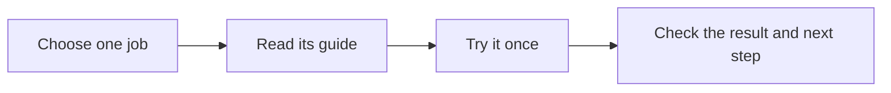

# LSS Task Library

Use these guides to save time on work that helps your business. Pick one job and follow its steps. Use the [Task Library Dashboard](https://blitzmetrics.com/task-library-dashboard/) to find that guide, then check its result before you pass work to the next person.


```mermaid
flowchart LR
  A[Choose one job] --> B[Read its guide]
  B --> C[Try it once]
  C --> D[Check the result and next step]
```

New here? Open a guide on the [Task Library Dashboard](https://blitzmetrics.com/task-library-dashboard/) (public entry; this GitHub Pages app is embedded there) and copy its first-run prompt. Library-built ZIPs include `START-HERE.md`; an external provider's full suite may use its own setup guide. A ZIP gives you guides; app setup, account access, and optional schedules each need their own check.

**Public canon (hub lists):** [blitzmetrics.com/task-library-dashboard/](https://blitzmetrics.com/task-library-dashboard/). This GitHub Pages app is the embedded runtime (and stays `noindex`); do not list `github.io/task-library` as a separate public hub. The dated archive post is [blitzmetrics.com/task-library/](https://blitzmetrics.com/task-library/).


Hub-and-spoke skill library. This repo is the **hub**: the registry, the dashboard, and the default home for skill files. Skills can also live in their owner's own repo (the **spokes**) — the build pulls them in at build time.

## Layout

```
skills/<category-folder>/<slug>.md   skill files that live in this repo ("local")
build/registry.json                  slug -> source; THE index of the library
build/task-executions.json           distinct real executions, not article revisions
build/article-certifications.json    URL holds plus optional exact-revision semantic evidence
build/ARTICLE-SEMANTIC-REVIEWS.md    versioned semantic review/observation schema
build/standard_verification.py       derived per-task standard checks and review queue
build/categories.json                the 13 categories (order, icons, colors)
build/site-meta.json                 meta-article URL (counts and build date are derived)
build/build.py                       resolve -> validate -> compose dashboard/data.json
dashboard/                           index.html + app.js + generated data.json
Task-Library-Standard.md             the spec every skill.md must meet
.github/workflows/build.yml          CI: build + deploy to GitHub Pages
```

> **Bringing your own skill repo?** See [CONTRIBUTING-SKILLS.md](CONTRIBUTING-SKILLS.md) — the full guide to formatting and registering an external skill including the required fields, sections, source ownership and validation.

## Owning a skill in your own repo

Use the **Asset Tracker’s Task Library Dashboard tab** to record upkeep ownership when its approved feed is connected. A saved row alone does not prove a public update. Check the dashboard’s team-update notice before relying on this path:

1. Put your `SKILL.md` in your repo at `skills/<slug>/SKILL.md`, with `name` equal to the permanent slug.
2. Have the maintained source, exact revision and download reviewed in `build/registry.json` before importing operational updates.
3. On the existing catalog row, record an explicitly approved **Approved display Owner** and workflow **Status** (`wip`, `ready`, or `gap`). Check the import notice and affected public fields after an authorized release.

Field authority is explicit: the registry and maintained skill own membership, source, category, stage, article mapping, descriptions, flags and downloads. The approved tracker owns workflow Status; public owner attribution requires the separate Approved display Owner field and publication approval in the export receipt. Source changes require a reviewed registry change; a stale tracker URL cannot replace a commit pin. External fetch failures can reuse cached content, so verify the fetched revision separately.

## Validation

`build/build.py` rejects skills that: lack frontmatter or any required field, have `name` ≠ slug, use an unknown category/stage/status, or miss required sections (Inputs, Steps, Definition of done, Examples, Definitive article & links). It warns (build passes) on: stub language in a `complete` skill, <3 numbered steps, frontmatter/registry category mismatch. URL readiness also respects reviewed semantic holds in `build/article-certifications.json`; a hold can force a hub to WIP without falsifying its tasks' completion status and can never force a hub ready. Optional task-specific semantic reviews in that same file require a separate observation of the exact current article representation, renewed within 24 hours; see `build/ARTICLE-SEMANTIC-REVIEWS.md`.

The same build writes `dashboard/verification-queue.html`, `.json` and `.csv`. This per-task projection keeps document review, contributor status, article mapping/catalog state, semantic holds, attributed examples, execution records, acceptance and setup evidence separate. Unknown proof stays unknown. Use the queue to select the next bounded review; do not hand-edit it or infer a full pass from a nearby metric.

## Asset Tracker

The existing tracker holds operational updates and held candidates. Import only an approved task-tab export with public display owners, or an approved public-safe projection. Import is a separate setup step; this patch does not configure a feed or change sharing.

The CSV requires all four headers: `Slug`, `Catalog match`, `Approved display Owner`, and `Status`. Explicit blank cells are valid; missing or renamed headers fail. Each registry slug must occur exactly once as `catalog`; `held` rows are excluded even if they name a known task. Missing/unknown membership, duplicate/empty/unknown catalog slugs, malformed or partial exports fail before artifacts are written. Blank status preserves source status; blank display owner remains unassigned. The internal `Owner` column is ignored. Assignment or syntactically valid owner text does not establish publication consent.

Every enabled import also requires `--tracker-receipt <reviewed.json>` and an explicitly approved positive integer `--tracker-max-age-seconds <seconds>`. There is no default freshness window or future-date grace. The receipt must match the checked-out full commit SHA, catalog digest and exact CSV bytes. Missing metadata, mismatch, stale exports or future timestamps block import before source fetch or public writes. Never generate a fresh receipt from an old CSV merely to clear the guard.

The receipt contains exactly these six fields:

```json
{
  "schemaVersion": 1,
  "catalogCommit": "<current full 40-character checkout SHA>",
  "catalogSha256": "<SHA-256 of json.dumps(registry skills, sort_keys=True).encode('utf-8')>",
  "exportedAt": "<actual export UTC timestamp, YYYY-MM-DDTHH:MM:SSZ>",
  "inputSha256": "<SHA-256 of exact exported CSV bytes>",
  "approvedPublicFields": ["Status", "Approved display Owner"]
}
```

An authorized publisher must review the actual export and its publication scope before issuing this receipt. `approvedPublicFields` may contain only `Status` and `Approved display Owner`; a populated public field without corresponding receipt approval fails. Display names must be separately authorized for public publication, not copied from internal assignments. Keep client data, descriptions, flags, private URLs and internal owner names outside public fields. The receipt asserts the publisher's approval and binds it to bytes; it cannot infer consent or authenticate an untrusted receipt. Use an approved controlled export/receipt transport.

`trackerImport` records validated export time, freshness policy, revision/digests, approved fields, matched/excluded counts and local/fetched/cached source counts. A loaded import remains separate from successful source fetch, release and accepted execution.

**Workflow activation is blocked.** Both current workflows have CSV-only transport, with no approved bound receipt route or freshness policy. If `TRACKER_CSV_URL` is nonempty, they stop before fetching. Empty-feed builds continue normally. A separate reviewed activation change must retrieve the matching approved export and receipt through authorized access and pass the required receipt/policy arguments to the shared builder. This patch configures no feed, secrets, policy or transport.

New tasks and source changes enter through reviewed `build/registry.json` changes, followed by tracker reconciliation. Legacy feeds must migrate membership and the explicit public display-owner schema and supply bound dated receipts before activation; no implicit onboarding, owner publication or source override remains. See [the maintenance guide](MAINTAINING-THE-LIBRARY.md) and [contributor instructions](CONTRIBUTING-SKILLS.md).

## SEO

The dashboard itself is `noindex` (it's a utility, not the ranking surface — and it must never compete with the hub articles from a github.io origin). The build also emits **`dashboard/library-index.html`**: a plain semantic HTML fragment — category H2s, every task with its description, and links to mapped article hubs. Its summary derives the number of mapped hubs and the subset that is actually definitive from task status plus reviewed URL-level semantic holds. Paste it into the WordPress task-library page *below* the iframe (or template it in) so blitzmetrics.com serves an indexable representation of the library with internal links to the hubs. Refresh the paste when categories/articles change materially; the fragment is deterministic, so a diff shows when.

## Stable links to one task

The dashboard accepts a permanent `?task=<slug>` query and opens that exact guide
with its first-run controls. Closing the guide returns focus to its task row.
Typing a new search or choosing an article hub returns to ordinary browsing; an
unknown task name shows a message without opening a different guide. For example:

```text
https://local-service-spotlight.github.io/task-library/?task=positive-mentions-harvester
```

Prefer hub lists and human entry via `https://blitzmetrics.com/task-library-dashboard/` (embeds this app). Keep github.io deep-links for iframe/`postMessage` plumbing.

The WordPress dashboard page embeds this app across origins, so an outer-page query is
not inherited by the iframe. A same-domain wrapper may forward its validated `task`
value after the iframe loads with
`postMessage({btlTask: slug}, 'https://local-service-spotlight.github.io')`; the app
accepts that message only from `https://blitzmetrics.com`.

## Local build

```
python3 build/build.py          # writes dashboard/data.json + library-index.html, exit 1 on validation errors
```

## Recorded executions

[EXECUTION-LEDGER.md](EXECUTION-LEDGER.md) defines the additive run ledger and review CLI. Task slugs remain owned by the registry. Published meta-article volume and expected recurrence used in the importance score are separate from real recorded executions. An absent run history is unknown, not zero.

[Keep the Task Library useful](MAINTAINING-THE-LIBRARY.md) describes the improvement loop: check actual results, repair the maintained recipe, verify the download and public page, and use the next real run to test the lesson. Scheduled maintenance checks changes and known gaps in small batches; it does not certify every task by rerunning a build.
