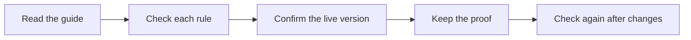

# Check the exact article your team uses

Use this check to see whether a task guide is clear, correct, and ready to use. It helps you avoid giving your team an old or confusing set of steps. It supports the [Task Library Standard](../Task-Library-Standard.md), which also calls for proof that the task works.



The details below explain how a reviewer or agent saves that proof.

`article-certifications.json` remains the one article-certification evidence file. Its existing `articles` object contains URL-level holds. Two optional arrays add task-specific positive or negative review evidence without changing catalog status:

- `semanticReviews` records a judgment about exact article bytes.
- `revisionObservations` separately records which bytes were observed at the canonical URL.

Both record types use `version: 1`, the exact registry `taskSlug`, the exact mapped `canonicalURL`, and one representation from `public-rendered-html`, `public-visible-text`, `wordpress-content-html`, or `repository-source`. Evidence references must be public HTTPS URLs or `sha256:<lowercase SHA-256>` references. Private paths and local URLs are rejected.

## Semantic review

Each review has `sourceSha256`, an RFC3339 UTC `reviewedAt`, `reviewer`, and exactly these criteria:

1. `openingContext` — requirement 1: the first two or three plain sentences explain what the page helps the reader do, why it matters, and a useful linked connection.
2. `roleScope` — requirement 2: the declared task recipe, topic hub, reference, story, or other role fits the page and its scope.
3. `owner` — the maintained canonical owner is named and supported.
4. `steps` — requirement 2: a task recipe has its trigger, access, prerequisites, ordered steps, expected results, measurable completion and receiving task; another page role provides its complete framework.
5. `links` — requirement 4: related concepts and entities route to the intended maintained destinations.
6. `sourceEvidence` — requirement 3: verified real examples explain what each source proves and preserve incomplete results.
7. `handoffContext` — requirements 2 and 8: the Content Factory position, actual inputs, checked output, remaining issues and receiving task or owner are clear.
8. `visualAndLayout` — requirement 8: an article-specific first-screen visual and lower task context were checked in the actual phone and desktop layouts.
9. `publicationStandards` — requirements 5, 6, 7 and 9: CTA, short URL, title/meta/structure/voice/entity rules, and evidenced E-E-A-T are checked.
10. `acceptanceResults` — acceptance evidence is tied to the exact article revision and stays separate from a published or contributor-complete label.

Each criterion has exactly `state`, `reason`, and `evidenceRefs`. State is `pass`, `unmet`, `hold`, or `unknown`. A review hash cannot prove that the same bytes are still current.

## Revision observation

Each observation has RFC3339 UTC `observedAt`, `observer`, `state`, `reason`, and `evidenceRefs`. An `observed` record requires a lowercase SHA-256. A `failed` record uses `sourceSha256: null`.

The article semantic gate uses the newest review and newest matching task/URL/representation observation. It remains `unknown` when the observation is missing, failed, older than the review, in the future, or more than 24 hours old. A fresh observation with a different hash is `unmet`. Only a fresh separate observation of the same representation and hash lets all ten criterion states determine the gate. An existing URL-level hold always wins.

The ten checks cover all nine definitive-article requirements plus the explicit owner and exact-revision acceptance controls. None of the earlier six generic checks can stand in for the opening, first-screen visual and rendered layout, Content Factory handoff, or publication requirements.

The 24-hour window is intentionally finite: yesterday's page capture cannot silently certify today's daily build. CI does not fetch the live page. Add a new observation only after an authorized tool or reviewer captures and hashes the named representation.

## Loader API

```python
evidence = load_article_semantic_evidence()
validate_article_semantic_evidence(all_tasks, evidence)
```

`evidence` has `semanticReviews` and `revisionObservations` lists. The build passes it to `standard_verification.derive(..., article_evidence=evidence)`. This evidence does not change contributor status, article catalog readiness, accepted execution, or setup success.
