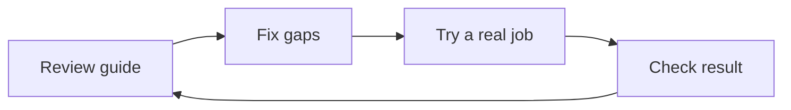

# Google Ads Analyzer instruction review

Use this review to see what still needs work before your team relies on this guide. The guide helps a local service business read its ad results and choose next steps. This review feeds the [Task Library verification queue](https://local-service-spotlight.github.io/task-library/verification-queue.html); it is not a completed ad-analysis job.

Reviewed September 15, 2026 by Codex independent instruction review. [Exact source](https://github.com/Goodrich-Dev/google-ads-maa-skills/blob/e55015f30b8ddbb9bea1a252905fa664d2f4e98a/skills/google-ads-analyzer/SKILL.md). SHA-256: `ef314fb17b24ee47a5f8842c8ef4709f6f66ef6c222b64edb506d7ba7e89ea99`. [Source receipt](google-ads-analyzer-2026-09-15-source.json).

The exact instructions were reviewed. They do not pass the full [Task Library Standard](../Task-Library-Standard.md).

| Check | Result | Evidence and next repair |
|---|---|---|
| Identity, trigger and scope | Pass | Source lines 2–4 and 71–87 identify the task and gather business context. |
| Ordered analysis and expected outputs | Pass | Lines 71–446 define a sequence and distinguish recent results from longer trends. |
| Read-only Ads boundary | Pass | Lines 147–149 separate analysis from account changes. |
| Package dependencies | Pass, file presence only | All ten inspected companion files exist at the same commit. This is not setup success. |
| Plain opening and useful connection | Needs work | Lines 11–26 use specialist language and do not explain the first action or downstream handoff. Numerical reading grade was not measured. |
| Inputs, access and prerequisites | Needs work | Gather the scattered requirements into a clear contract with checked prerequisites and missing-access behavior. |
| Acceptance and delivery | Needs work | Add measurable result checks, a saved-output read-back, and the receiving owner or task. Lines 717–735 need a proof requirement before completion claims. |
| Canonical article and example links | Unmet | No article is mapped. The skill lacks the house links and example sections. |
| Capability routing and current claims | Needs work | The generated generic model lane does not explain required tools. Quantitative and current-platform claims need source support. |
| Public article, first-screen visual and context | Unknown | No mapped article revision exists to inspect. |
| Accepted execution, setup and task-level run record | Unknown | No distinct execution evidence is recorded for this task. |

Next: repair the owned setup guidance where possible; keep upstream changes within their existing approval boundary. A future authorized run must record inputs, checked output, acceptance, handoff and a meta article. This review changes no contributor status, article certification, access, account setting or external publication hold.
