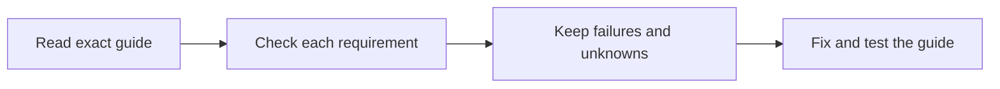

# Check each requirement before trusting a guide

Your team needs to know which parts of a work guide have been checked. This review makes those checks clear, so a weak step does not hide behind a “reviewed” label. It feeds the [Task Library improvement loop](../MAINTAINING-THE-LIBRARY.md): check the work, fix the guide, and try it again.

Reviewed September 17, 2026. This records instruction review and maintenance, not three completed business tasks. The [definitive-article recipe](https://blitzmetrics.com/definitive-article-guide/) explains the main guide; the [meta-article recipe](https://blitzmetrics.com/meta-article-prompt/) explains a record of actual work. The Task Library [standard](../Task-Library-Standard.md#record-which-instruction-requirements-passed) owns the new checklist.

## What was missing

The queue could say that exact instruction bytes were reviewed without showing which requirements passed. Contributor `complete`, article readiness, real execution, accepted result and new-user setup are different claims. None can fill in a missing instruction verdict.

Three writing guides also needed the newer opening rule stated explicitly: in the first two or three sentences, explain what this helps the reader do, why it matters, and a useful connection to the wider process or another task. Explain that relationship and link its maintained guide. Target grade five and review meaning, so the start is also clear to an eighth grader.

## What changed and what the review found

The existing instruction-review records now support five checks: opening, recipe, links, evidence and handoff. A source edit expires them. Missing checklists remain unknown, and partial passes cannot produce an overall pass. Each check shows its reason and evidence in the queue.

| Guide | Exact source SHA-256 | Opening | Recipe | Links | Evidence | Handoff |
|---|---|---|---|---|---|---|
| Create or update a definitive article | `790c9779a5e71b48fe2a982f52781e96f5085038dea232055793588a656c2b77` | Pass | Pass | Unknown | Pass | Pass |
| Write the opening and context | `2118243b8b030d5738fe83d3514f2f5e792e9f8d0b4457e59999a3b8ae9fee3b` | Pass | Pass | Unknown | Pass | Pass |
| Write a meta article | `d442d8bcb0a667057a12814afc16d0d23545601eea6433ff1e16405d1f5ef88e` | Pass | Pass | Unknown | Pass | Pass |

An independent reviewer inspected all three files and their contracts. The openings explain a real task, benefit and connection. Their approximate reading diagnostics were 3.27, 3.92 and 2.90, using the Flesch–Kincaid formula with Pyphen's US-English syllable approximation. These scores are screening aids; the quoted meaning reviews in `build/instruction-reviews.json` are the actual editorial judgments.

Browser readbacks confirmed the main guide and Content Factory's purpose, and several other owned pages loaded. Some navigations timed out, and the complete set of task links and anchors was not verified. **Links remain unknown for all three reviews.** The maintenance process now carries such holds forward and continues with other actionable work instead of repeating one unavailable lookup every day.

The local build also fetched changed Google Ads instructions from the existing external source. Its earlier review no longer matches. That expires its reviewed status without changing the contributor's status or editing the upstream repository.

## Validation and limits

- 108 build tests and 89 script tests passed. Tests cover missing or malformed checklists, stale source hashes, failures, unknowns, held checks and safe rendering.
- All seven generated archives passed integrity and expected-file checks. A valid archive is not proof that someone installed it, connected accounts or completed a first job.
- Search and the expanded checklist were tested in the actual generated page. The expanded evidence was visually reviewed at 390 × 844 and 1280 × 800; the phone view had no horizontal overflow.
- Task identities, contributor statuses, article mappings, owners and stages did not change. No article semantic hold was lifted and no accepted execution or setup success was invented.
- The build and ordinary public queue observed during this review show 275 current instruction reviews, 125 contributor-complete labels, and zero fully verified tasks. The three new checklists are partial reviews, not three overall passes. Deployment and public readback require their own receipts.

## What happens next

Finish the named link checks, then use the generated queue to review the next actionable guide. Extend the existing evidence records to capture exact-revision article acceptance, actual setup and accepted results before those gates can pass. Test those records on one authorized real task, with its starting conditions, measured result, acceptance and next handoff. Preserve every failure and use it to improve the recipe before the next run.
