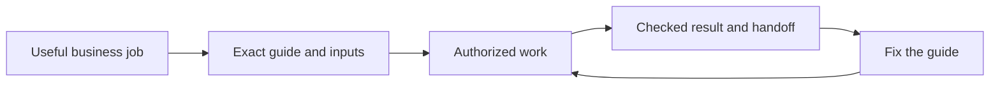

# Help the library lead to useful work

Use one guide to get a result you can check. This saves time when your team passes work to the next person. The [Content Factory](https://blitzmetrics.com/content-factory/) connects those jobs, while each guide supplies its inputs, checks and next handoff.

This root-cause analysis asks why broad documentation coverage has not yet produced broad verified use. The repair changes starting instructions and maintenance behavior. It does not turn missing evidence into a pass.

## Evidence at the October 5 review

The generated queue and execution ledger show 276 tasks across 13 categories, 275 exact instruction reviews, 19 passes of all five written requirements and 257 unknown written-check results. Contributor labels separately show 126 complete, 127 needs-work and 23 gaps. These are not 126 independently verified business tasks.

234 tasks map to an article; 42 do not. They map to 53 article URLs. Seventy task article roles remain unknown. Three shared article holds affect 19 rows; they require shared repairs rather than 19 rediscoveries. The tracker import is not configured, so no owner values were loaded. That does not prove nobody owns the work.

Before this repair began, the ledger held 23 attempts: 10 completed, 12 partial and one blocked. All named just two documentation tasks. No setup review was recorded. No task had every verification gate closed. These limits describe the library's recorded evidence, not all work performed elsewhere. The historical inventory of 88 meta articles is separate from these attempts.

## Causes and repairs

| Cause | Evidence | Repair and acceptance |
|---|---|---|
| Documentation counts can overshadow useful results | 275 reviewed files versus 19 explicit written passes; recorded runs cover only two tasks | Keep those measures separate. Capture task-bound outputs and receiving acceptance during existing authorized business work; measure distinct task and category coverage. |
| A release hold stopped independent work | Recovery instructions prioritized polling until the whole release cleared | Retain the blocked release and reuse its successful checks, while allowing another bounded actionable batch. No new run for a retry. |
| An obsolete queued job held the publishing pipeline | The older deploy had no runner or steps; the current source included it and waited behind it | Verify source inclusion and no deployment start before cancelling an obsolete queued run. The successor deployed after that cancellation. Preserve evidence and normal release checks. |
| The dashboard and ZIP asked for different starting details | The web prompt omitted output location, approved actions and saved-run input | Add the same three fields, require full article inputs when relevant, and retain the same execution ID on continuation. Test the field contract against the maintained ZIP onboarding. |
| Catalog order looked like required task order | Suggested previous/next stations can differ from a guide's real handoff | Label these as browsing links in the app and generated downloads. The guide's Inputs and Handoff sections remain authoritative. |
| Business-value ranking lacks actual use and effort evidence | The queue's revenue/frequency scores are labeled editorial estimates; effort is unknown | Use current evidenced business context to choose the next cohort. Record effort assumptions and accepted results in existing records. Do not invent ROI or create a second task registry. |

The last two operating gaps need follow-through: recover the approved tracker feed and verify actual imported fields; connect existing authorized business executions to their task recipes. This review does not authorize access changes, client jobs or outreach to obtain evidence. A beginner test remains distinct from agent checks and does not block independent repairs.

## Exact opening and changed-source review

The opening says: “Use one guide to get a result you can check. This saves time when your team passes work to the next person. The Content Factory connects those jobs, while each guide supplies its inputs, checks and next handoff.” The linked maintained Content Factory guide supplies the broader workflow. The table and checks below deliver this review's promise to identify and repair the operating gaps. Reading scores alone are not acceptance.

The ZIP's maintained START-HERE opening and prompt are unchanged. The dashboard now requests its same saved-result, approved-action and prior-work fields. The selected exact guide and task URL remain in the copied prompt. The reusable helper blocks change browsing labels only; they do not rewrite a task's recipe or certify its handoff.

## Verification and scope

Source tests check the starter fields against ZIP onboarding and preserve the selected guide, current article inputs, access checks and scheduling boundary. Browser checks cover phone and desktop prompt text, browsing labels and overflow; all media stay muted. Archive checks cover all seven outputs after generated helper changes. Public readbacks and the run ledger retain the actual release state.

The prior authority-guide release is a separate execution and is accepted only for its published outputs. This shared first-use repair has its own actual execution ID, `first-use-rcf-20261005-2343`, starting at 23:43:01 UTC. It creates no completed business-task runs. The next worker checks the published source and downloads, then selects the next evidence-backed earning or delivery path from the existing queue.
