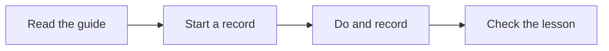

# Start the work record with the task

If you run a business, save what happened while your team does the work. This helps the next person follow the useful steps and avoid the same mistakes. The [task-guide checklist](https://blitzmetrics.com/definitive-article-guide/) explains how to connect that record to the maintained instructions.

## Published scope

[Task Guides and Work Records](https://localservicespotlight.com/meta-articles/) is a framework explainer. Its previous diagram and final instruction deferred the work record until after a result. The opening lacked an explained link in its first three sentences. This repair changes the opening, title, compact lead diagram, run-start instructions, counting explanation and lower context arrow. The canonical URL and publication state are unchanged.

Raw WordPress content before: `04bf670511bd06f17432771bd247961a3765084ec234a87ebdf4d3f37e7b5383`.

Published content after: `39a0627a5a7904ce63e126e2732b66e8d433cf7f22fbe59390bab38a324953e5`.

The title is separately checked metadata. The saved source exactly matched the candidate. Ordinary public full-text and media-list comparison passed on September 22 at 12:59:59 UTC. All ten original image tags and their attributes, four source occurrences of the two YouTube URLs, and all existing link destinations were retained. This is source preservation, not playback or whole-page evidence acceptance.

## Independent review and visual checks

The three-sentence opening explains a business owner's task, the value of repeating good work, and the role of the linked checklist. An independent reviewer counted 40 words and 47 syllables: Flesch–Kincaid estimate 3.48. This is a diagnostic plus a meaning review, not a novice-human comprehension test. The reviewer caught an ambiguous link label and a remaining after-work arrow; both were corrected before publication.

Preview and ordinary public first-screen checks passed with scripts on and off. At phone 390×844, the full diagram was 319×194 CSS pixels and ended near y=643. At desktop 1280×800, it was 596×194 and ended near y=613. The complete opening, four named steps and connecting arrows were readable. Neither checked width overflowed after layout settled. Immediate captures sometimes retained a previous frame; those were not accepted. The actual page shell and styles were used for the preview; lower-page WordPress embed transformations were checked in the public text/media comparison, not certified by the raw preview.

## What this does not certify

This page has no canonical task mapping in the current registry or article-certification file. Its URL appears as a reference inside task content. It remains a supporting framework page; this repair creates no new canonical mapping or semantic certification.

Broader business figures, changing SEO metrics, platform/runtime claims, historical examples and lower-page media still need separate evidence review. No first-user installation, schedule, accepted business result or whole-library verification was performed by this copy repair. The new authoring attempt is recorded once with its actual partial state; older ended attempts remain closed.

The next worker should test the revised instructions during a real task, then save the actual setup, result and handoff evidence. An agent rehearsal must remain distinguishable from an unassisted novice-human test.

## First-use evidence support

The library can now record a versioned manual-guide setup review on an actual execution. It records the downloaded package and extracted guide, inputs and access, checked result and next handoff. A setup pass requires an unassisted novice-human attempt, an independent acceptance review and a matching fresh recipe observation. Agent rehearsals and assisted attempts remain scoped evidence; installation and scheduling remain uncertified. The source ledger is public, so participant codes and all prose must be safe to publish.

Independent review found and corrected an executor-code disclosure in the public projection, signed proof URLs and mutable acceptance decisions linked to setup history. Existing linked decisions and setup reviews are now retained; corrections add review IDs. The final build passed 149 build tests, 89 script tests and seven archive checks. Three additional independent regression tests passed. These software checks do not establish real setup success: no production setup receipt was added.
