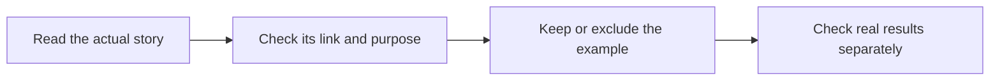

# Check which stories count as task examples

This review checks six stories linked to our task-record guide. It helps your team tell a useful work story from proof that a job passed. Use the [task-record guide](https://blitzmetrics.com/meta-article-prompt/) to write the result and the evidence you still need.

## Scope and rule

The September 10 inventory counted six entries although both explicit meta-taxonomy and explicit meta-language fields were false. This September 24 review read all six current editable WordPress bodies and their normal anonymous public pages. Each public page returned 200 and contained the complete saved rendered text. Initial bare Python requests returned 403; an ordinary browser-header request worked. Those earlier responses were a checker limit, not proof that the pages were broken.

The rule requires a published account of actual work and a contextual authored link to this canonical method. A related-reading link alone is insufficient. This review checks example eligibility. It does not independently accept the sources' delivery, rights, price, token, time or savings claims, and it adds no completed business executions.

## Six source decisions

| Source | Source evidence and decision | Exact content SHA-256 |
|---|---|---|
| [Derive, don't maintain](https://blitzmetrics.com/derive-dont-maintain/) | Recounts the stale-count investigation and failed checks. “The format of this write-up follows our meta article standard” directly links the canonical guide. Retain; explicit meta language is true. | `5dde2602330d01c737fd3d8a5cf55922b607746bf27373ab693ab328f14693d7` |
| [Ensiteful Marketing build](https://blitzmetrics.com/how-claude-agent-built-ensitefulmarketing-com/) | Recounts a particular build and fixes added to its playbook, linking “writing meta articles after every build.” Retain; explicit meta language is true. Contact-form and author-account follow-up remain in the story. Two domain-price figures are not reconciled by this review. | `2eec6dd2a16dbab4f4dc0a33a8f821fa856606a15c83aabbde10dfd5cf4dd0b2` |
| [Knowledge Graph Explorer repair](https://blitzmetrics.com/knowledge-graph-explorer-every-spotlight-site/) | A particular debugging/rollout story, but its only canonical meta-guide link is in “Related.” Exclude from this hub's counted examples; keep the record and its source. This is not an execution failure finding. | `0976246a77752d4e65770653d5504fd6c0c25d019a3bae17626098ec6c4d44f3` |
| [Julian David entity-home build](https://blitzmetrics.com/julian-david-entity-home-build/) | Describes research, site/report work and remaining owner actions; says the agent wrote this article. Its own deliverable receipt links “How we write meta articles like this one.” Retain; explicit meta language is true. | `056c783d77cb3b1b152db0fafb3f17af76e255fc2e67dc7419290c675c8fd5a0` |
| [Dennis Yu speaker reel](https://blitzmetrics.com/building-dennis-yu-speaker-reel-for-event-organizers/) | Recounts sources, cut choices and the unfinished second reel. The own-deliverable receipt links “How we write meta articles like this one.” Retain; explicit meta language is true. No media playback or result acceptance occurred. | `f464ae099838cacef905c5ced0b1336edff888e98bbfb89c3e4bc5b09833d9e9` |
| [Jobber integration](https://blitzmetrics.com/how-we-integrated-jobber-wordpress-home-services/) | Recounts clarification, popup/CTA work and staging limits; explicitly calls itself part of the meta-article pipeline and links the framework to explain documenting this project. Retain; explicit meta language is true. Its own metadata/image checks remain incomplete. | `6af9debdf77b9a0f4dd3784c86a350264d457b1f834596f79849d5e7a4002ac5` |

The five retained sources still lack the inventory's specific meta taxonomy; their taxonomy flags stay false. Only the supported language flags change. The excluded source remains in the ledger with `counted: false` and its reason. Five retained plus one excluded resolves these six classification conflicts. A separate false/false source under the Listen Notes hub remains outside this review.

## Count and article correction

This hub now has 59 counted examples, down from 60. The entire manifest has 88 distinct counted examples, down from 89. These are article counts. The original full-inventory date stays September 10; per-record September 24 dates and hashes identify the limited amendments. The other 54 entries under this hub were not rechecked in this batch.

The guide keeps the original 60-entry history, explains this correction, shows 59 in the badge and expandable list, and retains the excluded story as a related explanatory link. Its bottom caption now reflects the resolved classification checks instead of still saying six are open.

## Plain opening and connection checks

The unchanged guide opening says: “Write a short record of what happened when your team did a job. It helps the next person learn from the work and avoid the same mistakes. Link the record to the main task guide so you can improve its steps with proof.” The linked main guide was freshly read at its unchanged recipe revision. The sentence names the work, team benefit and proof-based recipe improvement; the body supplies the steps, checks and handoff.

The corrected example section says: “See how others recorded their work. These stories can help you write a useful record of your own. Use the Task Library to connect each story to its task and check what evidence is still missing.” The Task Library link points to the maintained public entry. The section follows through with the review date, classification reasons, counted list and limits. Meaning was checked from these words and their destination; no reading score substitutes for comprehension.

## Ownership and remaining evidence

The maintained Asset Tracker's task row had a blank Owner field, an old `/meta-article-prompt-template` article URL and a description assuming public release. The URL and description were corrected in place. The existing contributor status was preserved; it is not certification. An author byline alone does not name who maintains the recipe. Ownership remains open pending an actual assignment.

The six-example classification review does not finish the whole article's source, links, publication, visual, setup or result-acceptance gates. Example claims still need their own original receipts where relevant. Next resolve the maintained owner and select a bounded source/acceptance gap from the generated queue; do not recount this review as another business execution.

## Exact guide revision and scoped checks

Before raw content SHA-256: `fcf0a687c6f507222fd7f6302e3011b3ae2bf350ea6fc57a40328bf3e3a383c5`. After raw content SHA-256: `f058250547fc893f952415afcf33cc5957bcb70419502f74dbeb3a8475f9590a`. Independent Codex / GPT-6 Luna classification and wording review passed this exact candidate and the six amended orbit records. Root checked its interpretations against the sources, linked destinations and saved/public result.

The opening, lead diagram, embedded skill, setup and source media are unchanged. Title, excerpt, canonical URL, status, original date and featured media were preserved by the guarded save. The changed guide list/caption and maintenance record diagram were visually checked at phone390×844 and desktop1280×800 on normal canonical URLs. The expanded guide list has59 entries and excludes the related-only story. The maintenance diagram uses downward arrows on phones and rightward arrows on desktop. No media was played. Initial independent HTTP reads retained a cached60-entry body; that observation remains in private evidence and does not undo the exact saved-source or fresh browser results.

Carry forward only the four previously supported criteria—opening, role, steps and handoff—after comparing their relevant unchanged source. Owner is unmet because the maintained row is blank. Complete links, source evidence, full-page visual/layout, publication standards and accepted execution remain unknown. The six source classifications are resolved; the other54 examples and individual result claims are not certified.

Final ordinary anonymous HTTP check at2026-09-24T19:08:05Z returned200 with the complete exact saved rendered text and equal media; the earlier cached60-entry body is superseded. The public maintenance record also returned200 with complete saved rendered text and equal media. The current deployment omitted source-sheet overrides because its tracker configuration was empty; the saved tracker repair is not a claim of active feed integration.
