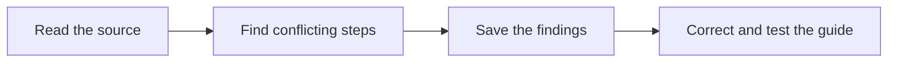

# Check the guide for recording a task

This review checks whether our guide gives your team clear steps for saving what happened on a job. Clear steps help the next person learn from the work. It supports our [main task guide](https://blitzmetrics.com/definitive-article-guide/), which connects each recipe to proof of its result.

## Source reviewed

**Canonical URL:** `https://blitzmetrics.com/meta-article-prompt/`  
**Task:** `write-meta-article-documenting-agent-work`  
**Representation reviewed:** authenticated WordPress content HTML  
**Source SHA-256:** `1952b6ead82a6a9aa0d0f96f0e976b34c957351fe155fe8ddd56b6fc7e767fde`

This is an editorial review of saved source only. It does not establish what an anonymous visitor sees, responsive placement, destination health, metadata, a real run, setup, or acceptance.

## Decision

The source has a clear Process-stage Content Factory position, explicit inputs, measurement, and handoff. It is not ready for a full semantic pass because the required opening connection is outside the first three sentences and its trigger conflicts within the same source. Source-only inspection also cannot verify ownership outside this article, links, examples, rendered layout, acceptance evidence, or the claims that agents automatically improve and that this is a “gold standard recipe.”

**Separate metadata observation:** Python measured the title in `105645.before.json` as 66 characters: “How Meta Articles Let My AI Agents Document and Improve Themselves.” That exceeds the under-60 rule, but the JSON capture has its own SHA-256 (`ba42e8df92faee9dad5f5f8c17eb611d91c43edd4d6d9b5e0e27dde48553dfc0`), so it is not a verdict tied to the reviewed content-HTML hash.

## Criteria

| Criterion | State | Source evidence and reason |
|---|---|---|
| Opening context | **unmet** | The first three sentences say, “Write down what you did…,” “This guide shows…,” and “Start the record….” They explain what and use, but contain no linked relationship. The first linked connection begins only in the following paragraph: “This guide is part of The System…”. |
| Role and scope | **pass** | The source labels a “Canonical task page · Content Factory / Process” and defines the outcome as an evidence-backed meta article for an actual task execution. |
| Owner | **unknown** | The source uses “owner” as a required input/next action but does not name the maintained canonical owner. The owner may be in a maintained registry outside this article; that record was not reviewed. |
| Steps | **unmet** | The page-level contract says, “Start when A task execution reaches a complete, partial, or failed result,” while the embedded skill says, “Begin this record when the task starts … including blocked, partial and failed results.” Those triggers cannot both define one repeatable start condition. |
| Links | **unknown** | The source includes internal explanatory, Task Library, Content Factory, recipe, and WordPress-posting links. Source inspection cannot establish their targets’ meaning, availability, or current maintenance. |
| Source evidence | **unknown** | It links a “real meta article” and lists 60 “verified meta-articles,” but these claims and destinations were not independently inspected. The source also asserts that agents “automatically get better” and calls this a “gold standard recipe”; neither has an exact acceptance receipt here. |
| Handoff and Content Factory context | **pass** | The explicit Process-stage map says evidence comes from work in any stage; the handoff registers the run, feeds a checked lesson to the canonical recipe, and routes authorized release to the WordPress posting task. |
| Visual and layout | **unknown** | Source contains an SVG lead diagram with caption and a Content Factory map, but no desktop 1280x800 or mobile 390x844 rendered inspection occurred. Source cannot prove first-screen visibility or readability. |
| Publication standards | **unknown** | The reviewed content HTML cannot prove metadata, CTA placement, short redirect, entity routing, E-E-A-T, or live publication behavior. A separate JSON capture has a 66-character title, but that is not tied to this content hash. |
| Acceptance results | **unknown** | The source asserts “Definitive task recipe” and “60 verified meta-articles,” but no exact-revision acceptance receipt, independent review, or fresh matching observation is included in the supplied source. |

## Top three bounded fixes

1. **Resolve the trigger conflict.** Choose whether the record starts when work starts (including blocked work) or after a result, then make both the page-level contract and skill say the same thing.
2. **Fix the opening.** Put the linked relationship in sentence three, while retaining the what and why in the first two sentences.
3. **Locate or add the owner record.** The page can point to a maintained registry, or name the owner near the task identity; a source-only review cannot infer it.

The separate JSON title observation is a metadata fix for a later read-back, not an HTML-hash semantic result.

## Proposed opening edit

> Save what happened when your team tried a task. This helps you check the work and avoid the same mistakes. Link the record to the [main task guide](https://blitzmetrics.com/definitive-article-guide/) so its next user can follow better steps.

This is a proposed copy change only. It was not published or tested in a browser.
