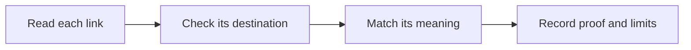

# Check the links in the publishing skill

This review checks where the publishing skill sends a reader next. That helps a team find the right steps before it shares a guide. Use the [publishing guide](https://blitzmetrics.com/skill-publishing-standard/) for the work; this page records the link checks and their limits.

## Exact source and decision

Reviewed September 26, 2026 by Codex root. Skill `publish-skill-and-task-page`, source SHA-256 `018a076e1b85ea983a73295aa5abe3a56c8d5c6f3e6fdb703c849b8bb8bae9c9`, repository base `77d7e7e3515316d50b49819e242091707941e772`. All ten distinct Markdown destinations were reviewed. **Links: PASS** for this instruction revision. The other four instruction checks retain their September 25 judgments because the exact skill, relevant source and output are unchanged. This makes all five instruction requirements pass; contributor status stays `needs-work`.

The skill begins: “Publish one clear task guide that your team can find and use. Keep its web page, skill file, and library entry in sync so no one follows old steps. Start with a checked task recipe, then use this guide to publish and check its copies.” These words name the work, the reason to keep copies current and the earlier recipe check. The linked definitive-article guide explicitly explains task triggers, inputs, ordered steps, measured results and handoff. The publishing skill's seven steps deliver its stated publishing and checking method. Neither this opening nor the prerequisite link claims that a particular recipe has already passed review.

The opening of this review names the link check, its value and the linked guide it supports. The destination table below delivers that promise. The unchanged guide's existing flow and Content Factory context were checked in the September 25 review; this follow-up does not renew full-page visual certification.

## Destination and meaning checks

| Destination | Why the link belongs here | Observed evidence |
|---|---|---|
| [Definitive-article guide](https://blitzmetrics.com/definitive-article-guide/) | Explains the checked recipe that must exist before publishing, including trigger, inputs, steps, result and handoff. The repeated “current article guide” label names the same maintained standard. | Anonymous HTTP200, meaningful current body and exact current opening reviewed. |
| [Document a task](https://local-service-spotlight.github.io/task-library/?task=document-a-task#task-document-a-task) | Supplies the source method and its checks. Its actual steps and handoff point back to publishing the skill and page. | HTTP200; actual public record is “Document a task,” mapped to `/how-to-document-a-task/`, with a full9070-character generated guide. Actual public routing functions select this slug. |
| [Contributor guide](https://github.com/Local-Service-Spotlight/task-library/blob/main/CONTRIBUTING-SKILLS.md) | Gives repository layout, source registration, connected-tracker prerequisite, public field comparison and release checks. It links back to the publishing guide. | The exact blob URL rendered current document text in the web reader. Anonymous raw source matched maintained file bytes. One Python HTTP request returned429; retained as a checker limit, not evidence of a broken destination. |
| [Article guidelines](https://localservicespotlight.com/article-guidelines/) | Supplies the checks used for article quality assurance, plain openings, visuals and source-backed publication. | Anonymous HTTP200; current checklist and quality-review content read. |
| [Content Factory](https://blitzmetrics.com/content-factory/) | Places preparing the method in Process and its checked release in Post; promotion remains a separate decision. | Anonymous HTTP200; current four-stage framework and task/acceptance explanation read. |
| [Meta-article guide](https://blitzmetrics.com/meta-article-prompt/) | Explains the work record required for an actual execution, with inputs, exact revision, decisions, result and next step. | Anonymous HTTP200; body distinguishes required writing from authorized publication and real results from claims. |
| [Task Library](https://local-service-spotlight.github.io/task-library/) | Connects recipes and their evidence; its learning-loop text describes checking the outcome, writing the record and linking the task/run ID. | Anonymous HTTP200; actual public data and learning-loop content reviewed. |
| [Maintained publishing guide](https://blitzmetrics.com/skill-publishing-standard/) | Owns the same publishing task: matched file/page/registry, supported publishing route, import check and public readback. | Anonymous HTTP200 with meaningful body. Fresh saved source unchanged at `7857ea9ce9ff959f8470dab5fd8455c5e406fd82a5edb086936793b584a0cf2b`. |
| [This publishing task](https://local-service-spotlight.github.io/task-library/?task=publish-skill-and-task-page#task-publish-skill-and-task-page) | Returns to the exact task record, current guide and article mapping. | HTTP200; actual public record is “Publish a skill and its task page,” with full8416-character generated guide and expected canonical article. Actual public routing functions select this slug. |
| [Recipes and work records](https://localservicespotlight.com/meta-articles/) | Explains how a reusable recipe differs from a record of one run and how evidence supports reviewed improvements. | Anonymous HTTP200; current three-layer explanation, repeatable-task fields and improvement loop read. |

All links are maintained owned teaching or source destinations. The documentation task and publishing task link both ways; the contributor guide links back to the publisher. This closes the instruction-link evidence gap without claiming every link in the much larger canonical article was reviewed.

## Method and boundaries

The live app's actual URL parser and task-selection functions were executed with actual public task data and stubbed DOM calls. Both intended slugs selected the expected task. A missing-task control stayed missing. Stable row IDs use the corresponding `task-` prefix. This is code/data routing evidence, not a phone/desktop browser trial or novice setup receipt. No browser automation capability was available in this follow-up; the earlier layout checks apply only to unchanged surfaces.

The earlier independent reviewer appropriately left unavailable checks unknown. Its concern that the linked parent was only a generic writing guide is not supported by the current body: that body expressly defines the full task-recipe contract. Root checked the actual content instead of approving from a title or HTTP status alone.

This is a review follow-up to the ended September25 attempt, not a new execution or a resumed partial run. No completed-run count changes. The tracker feed remains unconfigured. Upkeep owner, article-wide links, historical source claims, full-page visual/publication checks, first-user setup and accepted result/handoff remain separate missing evidence.

Next: select a remaining gate in the generated queue. Do not repeat this link review unless the skill, destinations or routing dependencies change.
