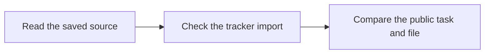

# Check that a saved guide reached its readers

This review checks the steps for publishing a task guide. It helps your team avoid old files and missing owner updates. Use the [publishing guide](https://blitzmetrics.com/skill-publishing-standard/) to keep the page, skill and library entry together.

## Actual scope and sources

This batch selected `publish-skill-and-task-page` from the generated queue, where contributor status remains needs-work. The current deployment omitted the tracker feed, yet contributor instructions implied a saved row would publish on the next build. No tracker configuration, sharing, access, secret or owner was changed.

Exact WordPress content before: `9705bf1a29c45961a6fb33404bfca3450bf280500ccdf6cb6ef67c00b6dd5cef`. Reviewed content after: `7857ea9ce9ff959f8470dab5fd8455c5e406fd82a5edb086936793b584a0cf2b`. Exact library skill after: `018a076e1b85ea983a73295aa5abe3a56c8d5c6f3e6fdb703c849b8bb8bae9c9`. The editable page, its embedded method, the maintained library skill, README and contributor guide were read together. Independent Codex / GPT-6 Luna reviewed wording and implemented the bounded import notice; root separately inspected the code and final source/visuals. Its initial stale tab-name concern was corrected using the current checkout. Its first article-opening quote used a lower paragraph; the receipt was corrected to the actual lead.

## Opening meaning and connections

The article and library skill open: “Publish one clear task guide that your team can find and use. Keep its web page, skill file, and library entry in sync so no one follows old steps. Start with a checked task recipe, then use this guide to publish and check its copies.” These words state the action, why consistent copies matter, and the prerequisite recipe. The linked definitive-article guide was freshly read through the maintained source connection and its public body was checked. It defines starting conditions, inputs, ordered steps, output checks and handoff. The new publishing and tracker sections deliver the lead's promise by separating saved source, imported data, deployment and exact public readback. A reading score was not used to certify meaning.

The contributor guide opens: “Add your task guide to the library so your team can find and use it. Check the public entry so no one follows an old file or a broken link. First use the publishing guide to prepare the skill and its matching web page.” Its link points to the exact page repaired in this batch. The body and sequence diagram explain registration, actual import and checked release. The initial source-format and cache guarantees were narrowed: a normal skill must validate; a plugin alone is not a registered skill; a cached fetch can be old and validation failure stops publication.

README now opens: “Use these guides to save time on work that helps your business. Pick one job and follow its steps. Use the Task Library Dashboard to find that guide, then check its result before you pass work to the next person.” The third sentence links the maintained public entry, and the new process diagram shows choose, read, try, check. Root made this final opening refinement after the independent review; no independent review of different bytes is claimed. The dashboard runtime is its embedded task directory, not a new public hub.

The new work-record section opens: “We made it easier to tell whether a task guide’s team updates reached the public library. This helps you avoid using old owner details or links. The publishing guide now explains what to check after a sheet edit or page save.” It links the repaired guide and reports the missing connection, actual code/document changes and remaining evidence. Its diagram shows the observed checking path.

## Repairs and checks

The article and embedded method no longer prescribe one browser's nonce workflow or ask again for permission already given. They use the site's maintained publishing route, current source, actual authority, guarded save and normal public checks. Drafts remain drafts when release is not authorized. The unsupported claim that a file cannot be linked or found was removed from both copies.

The build now emits `trackerImport` with no private path or feed URL: missing configuration, loaded input, or unknown validation outcome, plus row/match counts. The dashboard distinguishes missing import from unverified import. Loaded rows do not certify coverage, field accuracy, successful fetch, setup or execution. An invalid Source Repo on an existing task now creates a build error instead of silently claiming success with the old source. The same handler is covered by an isolated regression check.

Phone and desktop checks cover the changed guide sections, lead diagram, work-record diagram and dashboard notice. The two new article headings and new meta heading were shortened or resized after phone inspection. Exact saved source and metadata checks preserve the canonical URLs, titles, original dates and media. Initial HTTP cache responses are retained separately from fresh browser results. Final public and deployment receipts are saved with this run; a source save alone is not proof of release.

## Gate decisions and next step

The exact instruction review records opening, recipe, evidence labeling and handoff as passed. Complete destination review is unknown. Article opening, role, steps and handoff have scoped support; upkeep owner, complete links, historical source evidence, full-page visual/publication checks and accepted results remain unknown. No contributor status is promoted, no first-user setup is claimed and no completed business run is added.

Next inspect the existing approved tracker connection and intended tab, then verify actual imported values after deployment. Keep private data private; use the maintained source and generated queue instead of another tracker. Other task-standard gaps stay open.

Final anonymous canonical HTTP reads returned200 with complete exact saved rendered text and equal media for the guide and run record. Earlier cache failures are retained. Root checked the maintained parent recipe and public library entry at their normal URLs; initial bare user-agent failures were checking-method limits. The final README opening and diagram were reviewed by root after the independent draft review.
